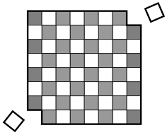

## Гипотеза  

### Научно-исследовательская работа (НИР)

**Обладает рядом отличительных черт**  

- в отличие от работ по картам Таро, Астрологии, работ Плоскоземельщиков или трудов религиозных деятелей или тех, кто верит в теории заговора...  

1. строгая работа с терминологией  
2. есть выбор конкретного предмета исследования  
3. есть анализ исходной ситуации  
4. есть формулировка предполагаемой идеи, инновации для разработки  
5. есть формализованные методы проведения исследования  
6. есть подтверждаемые статистически, фактически, компьютерным или мат.моделированием результаты  
7. есть повторяемость результатов  

---  

**Гипотеза** (в науке, в философии) (от греч. hipothesis основание, предположение) - положение, выдвигаемое в качестве предпологаемого объяснения некоторого явления.  

**Гипотеза** (в исследовательской работе по ИТ) - это обоснованное предположение о достигаемом положительном (как правило) эффекте для решаемой проблемы от внедрения определённой инновации (модели, мат. аппарата, инф. технологии, структуры данных, архитектуры ПО, паттерна проектирования).  

---  

**Пример из математики**  

> **Гипотеза Пуанкаре**
>
> Доказанная математическая гипотеза о том, что всякое односвязное компактное трёхмерное многообразие без края гомеоморфно трёхмерной сфере.
> Сформулированная в 1904 году математиком Анри Пуанкаре гипотеза была доказана в серии статей 2002-2003 годов Григорием Перельманом.
> После подтверждения доказательства математическим сообществом в 2006 году гипотеза Пуанкаре стала первой и единственной на данный момент решённой задачей тысячелетия.

  
  

Тренировка работы с ГИПОТЕЗОЙ - сформулируйте объясняющую гипотезу:  

1. Почему Луна всегда к нам одной стороной?  
2. Бывали на море? Приливы видели? Почему существуют в течение суток два прилива?  
3. Корабль отплывает от пристани и постепенно уходит вдаль, через 7 км он начинает скрываться за линией горизонта.  
4. Бывает так, что удалившись на 10 км и далее корабль всё равно виден с берега. Почему?
5. Почему на закате небо краснеет?  
6. Фото (в репозитории) - взлетает косм. корабль или садится?  
7. Почему после дождя радуга?  
8. Если вселенная бесконечна и кол-во звёзд в ней бесконечно, почему ночное небо чёрное?

  
  

---  

Чтобы что-то обосновать, нужно обладать достаточной эрудицией в предметной области занний.  
Чтобы выдвинуть новую гипотезу нужно быть "на переднем крае" науки:  
* то есть знать много того, что было ранее  
* знать многое что делается сейчас  
* нужно встретиться с настоящей проблемой в обсуждаемой предметной области  
* каким-то образом суметь подобрать идею для её решения  

Многие умеют играть на музыкальных инструментах, но только некоторые могут написать симфонический концерт или сочинить хит. Так и с научной работой, в том числе, и магистерской работой по ИТ.  

---  

Примеры формулировок гипотез из магистерских работ прошлых лет:  

> Алгоритм создания уникальных подписей ключевых кадров видеопоследовательности на основе темпоральных и пространственных характеристиках позволит решить задачу поиска заимствований видеофрагментов.  

> Внедрение методики конструирования сетевой информационной системы, основанной на избирательном отборе и обоснованном синтезе современных информационных технологий, может привести к синергетическому эффекту повышения качества маркетинговой деятельности предприятия за счёт автоматизации работы с большими объёмами данных, оптимизации логистики и снижения существующих рисков.

> Разработка концепции проектирования АРМ судьи по компьтерному спорту, основанной на ××××××, ×××××××, ×××××× положениях, повысит качество проведения спортивных турниров.

> Интеграция интерактивных дистанционных элементов взаимодействия в классический образовательный процесс, может привести к повышению качества образовательной деятельности из-за большей их вовлеченности обучающихся

> Использование нового подхода к миграции баз данных, основанного на пошаговом переносе всех её сущностей, позволит уменьшить количество операций проводимых в ручную и увеличить скорость обработки данных.

---  

В XIX и XX вв. проводились исследования (Анри Пуанкаре) как математики делают открытия.  
Всё довольно банально -  три этапа: подготовка, вынашивание, озарение.  
> Этап подготовки - Вы изучаете предметную область исследования, существующие решения, выявляете проблемы решения задачи. После нескольких итераций подхода к решению задачи она откладывается на подсознательном уровне.  

> Этап вынашивания - это когда вы непосредственно не решаете задачу - занимаетесь любыми другими делами, а подсознание переваривает, работает, генерирует и перебирает варианты. 

> Если у вас уже был некоторый опыт и если повезёт, то может произойти озарение - возникнет какая-то более менее работоспособная идея - её можно взять за основу, для старта, начать с неё.

```txt
Назовите известные примеры (может и мифы) об озарении учёных и открытии ими новых закономерностей.  
```

Потом в процессе подтверждения или опровержения первичного решения (гипотезы) могут уже возникать новые идеи или модифицироваться старые. Всё это работает, если был пройден первый подготовительный этап - нужно буквально много знать о предмете исследования и смежных областях, нужно много работать.  

---  

Продолжаем тренировку - попробуйте выдвинуть способ решения такой задачи:  

- дана обычная шахматная доска (8х8) и набор костяшек домино, костяшки такого размера, что в точности покрывают две клетки доски;
- очевидно, что всю доску можно покрыть 32-мя костяшками домино;
- пусть из доски удалили две клетки, расположенные по краям доски на второстепенной диагонали;
- можно ли теперь полностью покрыть доску костяшками домино?

  

---  

Обсудим гипотезы - нужно выдвинуть и подтвердить программно:  

- можно ли найти значение числа Пи методом Монте-Карло?  


**Формулировки задачи**  
> 1. Написать программу, которая вычисляет Методом Монте-Карло число Пи за заранее заданное количество повторов, например, за 10000.  
> Подтвердить или опровергнуть возможность использования Метода Менте-Карло для вычисления приблизительного значения чила Пи
> 2. Написать программу, которая вычисляет Методом Монте-Карло число Пи с определённой заранее заданной точностью, например, до второго знака после запятой.  
> 3. Как меняется количество простых чисел на каждую последующую тысячу, начиная от 1 (1..1000, 1001..2000, 2001..3000, ..., 9001..10000)?  
Какие сложности возникунт, если нужно возвращать кол-во простых чисел из диапазонов (10010001..10020000, 10020001..10030000, ..)?  
> 4. В задаче используется обычный кубик с шестью гранями со значениями на гранях - 1..6. Если такой игральный кубик бросить 46 раз, то какое наиболее вероятно количество раз выпадет на верхней грани цифра 6?  

---  

<details> 
    <summary>Итоговая таблица из книги Великие математические задачи</summary>  
      
</details>

---  

Это уже к дисциплине АиРА:  
- изменение длительности сортировки массива по методу вставки с ростом числа элементов  
- изменение длительности сортировки массива по методу быстрой сортировки с ростом числа элементов  
- алгоритмы поиска (линейный, бинарный, тернанрый, Золотое сечение) экстремума или пересечения графика сложной функции с осью абцисс  

---  
