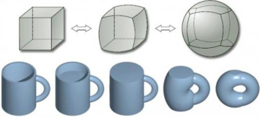
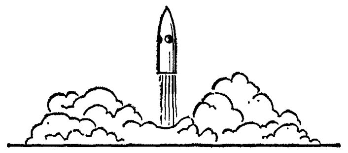

## Гипотеза  

### Научно-исследовательская работа (НИР)

**Обладает рядом отличительных черт**  

- в отличие от работ по картам Таро, Астрологии, работ Плоскоземельщиков или трудов религиозных деятелей или тех, кто верит в теории заговора...  

1. строгая работа с терминологией  
2. есть выбор конкретного предмета исследования  
3. есть анализ исходной ситуации  
4. есть формулировка предполагаемой идеи, инновации для разработки  
5. есть формализованные методы проведения исследования  
6. есть подтверждаемые статистически, фактически, компьютерным или мат.моделированием результаты  
7. есть повторяемость результатов  

---  

**Гипотеза** (в науке, в философии) (от греч. hipothesis основание, предположение) - положение, выдвигаемое в качестве предпологаемого объяснения некоторого явления.  

**Гипотеза** (в исследовательской работе по ИТ) - это обоснованное предположение о достигаемом положительном (как правило) эффекте для решаемой проблемы от внедрения определённой инновации (модели, мат. аппарата, инф. технологии, структуры данных, архитектуры ПО, паттерна проектирования).  

---  

**Пример из математики**  

> **Гипотеза Пуанкаре**
>
> Доказанная математическая гипотеза о том, что всякое односвязное компактное трёхмерное многообразие без края гомеоморфно трёхмерной сфере.
> Сформулированная в 1904 году математиком Анри Пуанкаре гипотеза была доказана в серии статей 2002-2003 годов Григорием Перельманом.
> После подтверждения доказательства математическим сообществом в 2006 году гипотеза Пуанкаре стала первой и единственной на данный момент решённой задачей тысячелетия.

  

Тренировка работы с ГИПОТЕЗОЙ - сформулируйте объясняющую гипотезу:  

1. Почему Луна всегда к нам одной стороной?  
2. Бывали на море? Приливы видели? Почему существуют в течение суток два прилива?  
3. Корабль отплывает от пристани и постепенно уходит вдаль, через 7 км он начинает скрываться за линией горизонта.  
4. Бывает так, что удалившись на 10 км и далее корабль всё равно виден с берега. Почему?
5. Почему на закате небо краснеет?  
6. Фото (в репозитории) - взлетает косм. корабль или садится?  
7. Почему после дождя радуга?  
8. Если вселенная бесконечна и кол-во звёзд в ней бесконечно, почему ночное небо чёрное?

  
  
